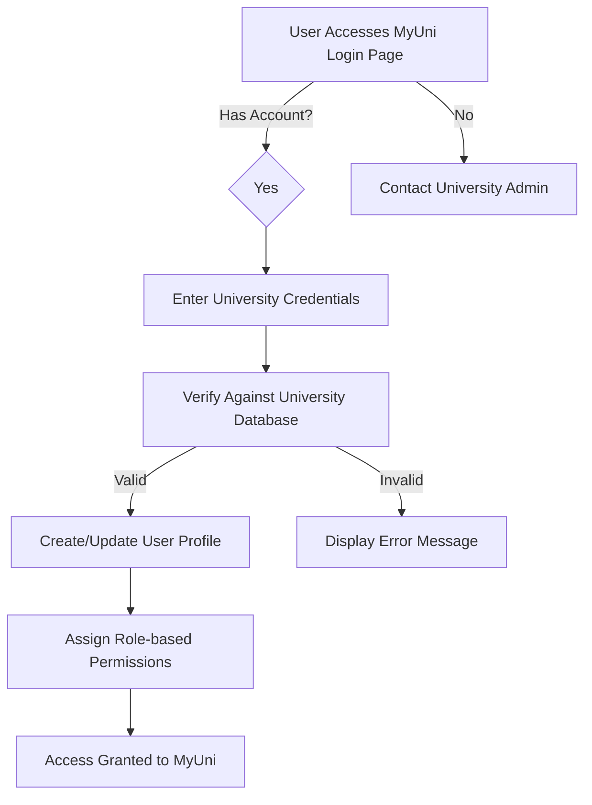
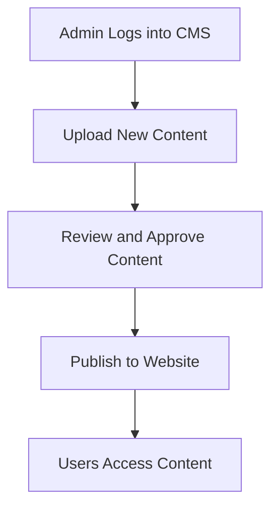
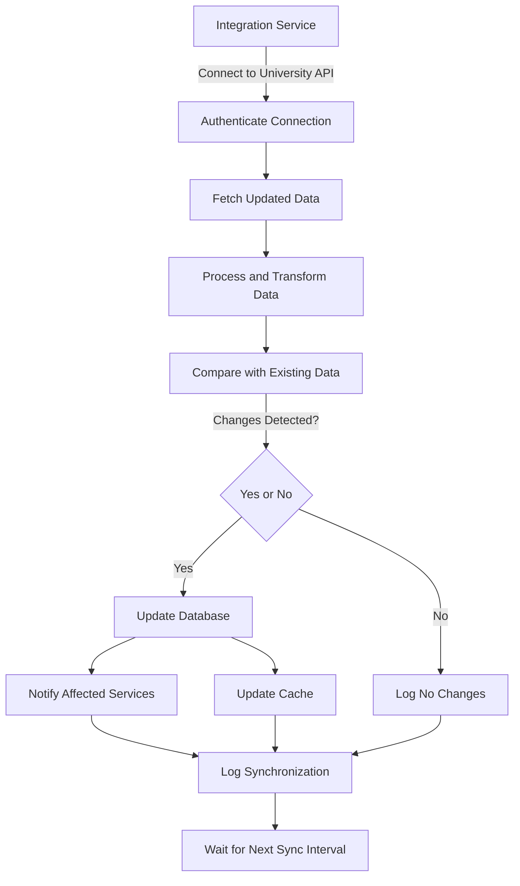
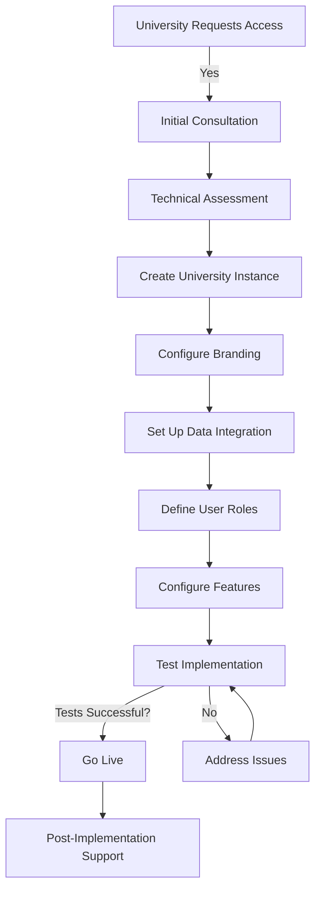

## MyUni: Analysis and Design Document

## 1. System Analysis

### 1.1 Project Overview

The MyUni project aims to address the limitations of existing university applications like MyUoM ([https://my.uom.gr/](https://my.uom.gr/)) and UniWA ([https://iam.uniwa.gr/](https://iam.uniwa.gr/)) by creating a unified, modular platform that can be easily adopted and customized by Greek universities. The project will develop a modern, scalable backend architecture with Content Management System (CMS) integration to provide real-time updates from official university sources.

### 1.2 Current System Limitations Analysis

**MyUoM and UniWA Current Limitations:**

| Limitation | Description | Impact
|-----|-----|-----
| Inadequate Login System | Lacks robust authentication mechanisms | Security vulnerabilities and limited user management
| Limited Backend Scalability | Architecture not designed for growth | Performance issues with increasing user base
| Absence of Real-time Updates | Manual updates required for information | Outdated information and administrative burden
| No Unified Framework | Separate implementations for each university | Duplicated development efforts and inconsistent experiences
| Limited Customization | Rigid structure difficult to adapt | Cannot meet specific university requirements
| Poor Data Integration | Limited connection to university systems | Manual data entry and synchronization issues

## **1.3 Stakeholder Analysis**

| Stakeholder           | Needs                                     | Pain Points                              | Expectations                                 |
|-----------------------|------------------------------------------|------------------------------------------|---------------------------------------------|
| Students             | Access to academic information, schedules, announcements | Outdated information, fragmented systems | User-friendly interface, real-time updates, personalized content |
| Faculty              | Course management, student communication  | Administrative burden, limited tools    | Streamlined workflows, content management capabilities |
| University Administrators | Platform customization, content management | Technical limitations, resource constraints | Intuitive admin panel, branding options, analytics |
| IT Departments       | System maintenance, integration          | Complex infrastructure, security concerns | Well-documented code, scalable architecture, security features |
| Other Universities   | Platform adoption and customization      | Development costs, technical expertise  | Easy implementation, customization options, shared resources |

## 2. Feasibility Study

### 2.1 Technical Feasibility

| Component  | Technology  | Feasibility  | Justification  |
|-----------|------------|--------------|---------------|
| Frontend  | React.js, TypeScript | High | Mature ecosystem, component-based architecture ideal for modular design |
| Backend   | Express.js  | High | Lightweight, flexible framework suitable for microservices |
| Database  | MySQL  | High | Robust relational database with strong community support |
| Deployment | Docker  | High | Containerization simplifies deployment across different environments |
| Optional  | Next.js  | Medium-High | Provides SSR capabilities but adds complexity |

### 2.2 Operational Feasibility

The system will integrate with existing university data sources through standardized APIs. The modular architecture allows for:

- **Phased Implementation:** Universities can adopt components incrementally
- **Customization Flexibility:** Each institution can tailor the platform to their needs
- **Scalability:** Architecture designed to accommodate growing user bases
- **Maintenance:** Centralized updates with distributed customization

### 2.3 Economic Feasibility

As an open-source project, MyUni offers significant economic advantages:

- **Development Cost Sharing:** Multiple universities contribute to a single codebase
- **Elimination of Licensing Fees:** Free and open-source software
- **Reduced Maintenance Costs:** Shared maintenance burden
- **Resource Optimization:** Standardized implementation reduces duplicate efforts
- **Community Contributions:** Potential for external contributions and improvements

### 2.4 Schedule Feasibility

The project can be completed within the GSoC timeframe with the following schedule:

| Phase | Duration | Key Deliverables
|-----|-----|-----
| Analysis & Design | 2 weeks | Requirements document, architecture design, wireframes
| Core Infrastructure | 4 weeks | TypeScript rewrite, authentication system, database schema
| Backend Development | 6 weeks | Microservices implementation, data integration
| Frontend Development | 4 weeks | UI components, responsive design, admin interfaces
| Testing & Refinement | 2 weeks | Bug fixes, performance optimization, security audits
| Documentation & Deployment | 2 weeks | User guides, API documentation, Docker images

## 3. Business Procedures

### 3.1 User Registration and Authentication

**Procedure Steps:**

1. User navigates to MyUni login page
2. System presents authentication options
3. User enters university credentials
4. System verifies credentials against university database
5. Upon successful verification, system creates or updates user profile
6. System assigns appropriate permissions based on user role
7. User gains access to authorized features and content

### 3.2 Content Management

**Procedure Steps:**

1. Administrator accesses CMS through secure login
2. System presents CMS dashboard with content management options
3. Administrator creates or edits content
4. Administrator previews content for accuracy
5. Content is submitted for approval (if workflow enabled)
6. Approver reviews content and approves or returns with comments
7. Upon approval, content is published according to schedule
8. Relevant users are notified of new content

### 3.3 Data Synchronization

**Procedure Steps:**

1. Integration service initiates connection to university data sources
2. System authenticates connection using secure credentials
3. Service fetches updated data based on predefined queries
4. Data is processed and transformed to match system schema
5. System compares fetched data with existing records
6. If changes are detected, database is updated
7. Affected services are notified of data changes
8. Cache is updated to reflect new data
9. Synchronization activity is logged for auditing
10. Process repeats at scheduled intervals

### 3.4 University Onboarding

**Procedure Steps:**

1. University initiates request for MyUni implementation
2. Initial consultation to understand specific requirements
3. Technical assessment of existing systems and integration points
4. Creation of university-specific instance in the platform
5. Configuration of branding elements (logo, colors, etc.)
6. Establishment of data integration connections
7. Definition of user roles and permissions
8. Configuration of university-specific features
9. Comprehensive testing of implementation
10. Training sessions for administrators and key users
11. Platform launch with ongoing support

## 4. User Stories

### 4.1 Student User Stories

### 4.1 Student User Stories

| ID  | User Story | Acceptance Criteria | Priority |
|-----|-----------|---------------------|----------|
| S1  | As a student, I want to view my class schedule so that I can plan my day. | - Schedule displays all enrolled courses   - Shows time, location, and instructor   - Allows filtering by day/week   - Sends reminders for upcoming classes | High |
| S2  | As a student, I want to receive real-time announcements so that I stay informed about important events. | - Notifications appear for new announcements   - Announcements are categorized by type   - Can mark announcements as read   - Can filter by department/course | High |
| S3  | As a student, I want to access my academic records so that I can track my progress. | - Shows current GPA and credits   - Lists all courses with grades   - Displays degree requirements progress   - Allows downloading unofficial transcript | High |
| S4  | As a student, I want to customize my homepage so that I can prioritize relevant information. | - Can add/remove/rearrange widgets   - Settings persist between sessions   - Provides default layout for new users   - Supports different widget sizes | Medium |
| S5  | As a student, I want to receive deadline reminders so that I don't miss important submissions. | - Shows upcoming assignments with due dates   - Sends notifications before deadlines   - Allows setting custom reminder times   - Integrates with calendar applications | Medium |

### 4.2 Faculty User Stories

| ID | User Story | Acceptance Criteria | Priority |
|----|-----------|--------------------|----------|
| F1 | As a faculty member, I want to post announcements so that I can communicate with my students. | - Can create, edit, and delete announcements   - Can target specific courses or departments   - Can schedule future publication   - Can attach files to announcements | High |
| F2 | As a faculty member, I want to view my teaching schedule so that I can prepare for classes. | - Shows all assigned courses   - Displays classroom locations and times   - Indicates number of enrolled students   - Allows adding personal notes | High |
| F3 | As a faculty member, I want to access student information so that I can track attendance and performance. | - Lists students enrolled in each course   - Shows student contact information   - Displays academic standing   - Respects privacy regulations | Medium |
| F4 | As a faculty member, I want to upload course materials so that students can access them easily. | - Supports various file formats   - Allows organizing materials by topic   - Tracks student access statistics   - Enables version control of materials | Medium |

### 4.3 Administrator User Stories

| ID | User Story | Acceptance Criteria | Priority |
|----|-----------|--------------------|----------|
| A1 | As an administrator, I want to customize the university's app interface so that it aligns with our branding. | - Can upload university logo   - Can set primary and secondary colors   - Can customize homepage layout   - Changes apply across all user interfaces | High |
| A2 | As an administrator, I want to manage user permissions so that appropriate access is granted. | - Can create and modify user roles   - Can assign roles to users   - Can define granular permissions   - Changes take effect immediately | High |
| A3 | As an administrator, I want to publish university-wide announcements so that all users are informed. | - Can target specific user groups   - Can set announcement priority   - Can schedule and expire announcements   - Can track read receipts | Medium |
| A4 | As an administrator, I want to configure data integration points so that information is accurate and up-to-date. | - Can set up API connections   - Can schedule synchronization intervals   - Can map external data to system fields   - Can monitor synchronization status | High |
| A5 | As an administrator, I want to view usage analytics so that I can optimize the platform. | - Shows active users and peak times   - Displays feature usage statistics   - Reports on system performance   - Allows exporting data for analysis | Low |

## 5. EPICS

### EPIC 1: Authentication and User Management

**Description:** Implement a secure, scalable authentication system that integrates with university identity providers and manages user profiles and permissions.

**User Stories:**

- As a user, I want to log in with my university credentials
- As a user, I want to manage my profile information
- As an administrator, I want to define user roles and permissions
- As a user, I want to reset my password securely
- As an administrator, I want to audit user activity

**Technical Components:**

- OAuth/SAML integration with university systems
- Role-based access control framework
- User profile management
- Password recovery workflow
- Multi-factor authentication
- Session management and security

### EPIC 2: Personalized User Experience

**Description:** Create a customizable, responsive interface that provides personalized content and notifications based on user role and preferences.

**User Stories:**

- As a user, I want to customize my dashboard layout
- As a user, I want to receive notifications relevant to me
- As a user, I want to set my communication preferences
- As a user, I want to access the system on mobile devices
- As a user, I want to navigate the interface intuitively

**Technical Components:**

- Responsive UI framework
- Widget-based dashboard system
- Notification service
- User preference management
- Mobile-optimized views
- Accessibility compliance

### EPIC 3: Content Management System

**Description:** Develop a comprehensive CMS that allows administrators to create, manage, and distribute content across the platform with workflow approval processes.

**User Stories:**

- As an administrator, I want to create and edit content
- As an administrator, I want to categorize and tag content
- As an administrator, I want to schedule content publication
- As an administrator, I want to manage media assets
- As an administrator, I want to implement approval workflows

**Technical Components:**

- WYSIWYG editor
- Content versioning
- Media library
- Content scheduling
- Workflow engine
- Content templates
- SEO optimization

### EPIC 4: Data Integration and Synchronization

**Description:** Create a robust system for integrating with university data sources to ensure real-time synchronization of information across the platform.

**User Stories:**

- As an administrator, I want to connect to university APIs
- As a user, I want to see up-to-date information
- As an administrator, I want to monitor data synchronization
- As a developer, I want to extend the integration framework
- As an administrator, I want to handle synchronization errors

**Technical Components:**

- API integration framework
- Data transformation pipeline
- Synchronization scheduler
- Error handling and logging
- Caching mechanism
- Webhook support
- Data validation

### EPIC 5: Multi-University Framework

**Description:** Design a modular architecture that supports multiple university instances with customization capabilities while maintaining a unified codebase.

**User Stories:**

- As an administrator, I want to create a university instance
- As an administrator, I want to customize branding
- As an administrator, I want to enable/disable features
- As a developer, I want to extend the platform
- As an administrator, I want to migrate between versions

**Technical Components:**

- Multi-tenant architecture
- Theme engine
- Feature flagging system
- Plugin architecture
- Configuration management
- Deployment automation
- Version migration tools

## 6. System Backlog

### High Priority Items

| ID  | Item                     | Description                                    | Effort Estimate | Dependencies |
|-----|--------------------------|------------------------------------------------|----------------|--------------|
| H1  | TypeScript Rewrite       | Rewrite existing codebase in TypeScript       | 4 weeks        | None         |
| H2  | Authentication System    | Implement secure login and user management    | 3 weeks        | H1           |
| H3  | Core Backend Architecture | Develop scalable microservices foundation     | 4 weeks        | H1           |
| H4  | Basic CMS Functionality  | Create essential content management capabilities | 3 weeks    | H1, H3       |
| H5  | Data Integration Framework | Build system for connecting to university data sources | 3 weeks | H3 |
| H6  | Student Dashboard        | Implement primary student interface           | 2 weeks        | H2, H4       |
| H7  | Admin Panel Core         | Develop basic administration interface        | 2 weeks        | H2, H4       |

### Medium Priority Items

| ID  | Item                     | Description                                    | Effort Estimate | Dependencies |
|-----|--------------------------|------------------------------------------------|----------------|--------------|
| M1  | Personalized Homepage    | Implement customizable dashboard               | 2 weeks        | H6           |
| M2  | Advanced Admin Features  | Extend admin panel with additional capabilities | 3 weeks     | H7           |
| M3  | Student Portal           | Develop academic records and course management | 3 weeks     | H5, H6       |
| M4  | Multi-Domain Support     | Enable multiple university instances          | 3 weeks        | H3, H7       |
| M5  | Notification System      | Implement real-time alerts and messages       | 2 weeks        | H2, H3       |
| M6  | Mobile Optimization      | Ensure responsive design for all devices      | 2 weeks        | H6, M1       |
| M7  | Content Workflow         | Add approval processes for content publication | 2 weeks    | H4           |

### Low Priority Items

| ID  | Item                      | Description                                   | Effort Estimate | Dependencies |
|-----|---------------------------|-----------------------------------------------|----------------|--------------|
| L1  | Advanced Analytics        | Implement usage tracking and reporting       | 3 weeks        | H3, H7       |
| L2  | Mobile App Optimization   | Enhance mobile experience beyond responsive design | 3 weeks | M6 |
| L3  | Additional Service Integrations | Connect to library, LMS, and other systems | 4 weeks | H5 |
| L4  | Advanced Customization    | Implement theming engine and extended branding | 3 weeks  | M4           |
| L5  | Community Contribution Framework | Create system for external developers | 2 weeks  | H1, H3       |
| L6  | Performance Optimization  | Enhance system speed and efficiency          | 2 weeks        | All high priority |
| L7  | Internationalization      | Add multi-language support                   | 2 weeks        | H4, H6, H7   |

## 7. Requirements Analysis

### 7.1 Functional Requirements

#### Authentication and User Management

- FR1.1: The system shall authenticate users against university identity providers using OAuth/SAML
- FR1.2: The system shall support role-based access control with customizable permissions
- FR1.3: The system shall allow users to manage their profiles and preferences
- FR1.4: The system shall provide secure password reset functionality
- FR1.5: The system shall support multi-factor authentication
- FR1.6: The system shall maintain audit logs of authentication activities

#### Content Management

- FR2.1: The system shall provide a WYSIWYG editor for content creation
- FR2.2: The system shall support various content types (text, images, files, videos)
- FR2.3: The system shall allow categorization and tagging of content
- FR2.4: The system shall enable scheduling of content publication
- FR2.5: The system shall maintain version history of content
- FR2.6: The system shall support approval workflows for content publication
- FR2.7: The system shall provide a media library for asset management

#### Data Integration

- FR3.1: The system shall connect to university data sources via REST APIs
- FR3.2: The system shall synchronize data in real-time or at scheduled intervals
- FR3.3: The system shall transform external data to match internal schema
- FR3.4: The system shall validate data integrity during synchronization
- FR3.5: The system shall log all synchronization activities
- FR3.6: The system shall handle synchronization errors gracefully
- FR3.7: The system shall support webhook notifications for data changes

#### Customization

- FR4.1: The system shall allow branding customization (logos, colors, fonts)
- FR4.2: The system shall support custom homepage layouts with widgets
- FR4.3: The system shall enable feature toggling for different universities
- FR4.4: The system shall permit custom CSS and theming
- FR4.5: The system shall allow customization of notification templates
- FR4.6: The system shall support university-specific content types
- FR4.7: The system shall enable custom navigation structures

### 7.2 Non-Functional Requirements

#### Performance

- NFR1.1: The system shall load pages within 2 seconds under normal conditions
- NFR1.2: The system shall support at least 10,000 concurrent users
- NFR1.3: The system shall handle peak loads during registration periods
- NFR1.4: The system shall implement efficient caching mechanisms
- NFR1.5: The system shall optimize database queries for performance
- NFR1.6: The system shall minimize network requests for mobile users

#### Security

- NFR2.1: The system shall encrypt all sensitive data in transit and at rest
- NFR2.2: The system shall implement OWASP security best practices
- NFR2.3: The system shall undergo regular security audits
- NFR2.4: The system shall comply with GDPR requirements
- NFR2.5: The system shall implement rate limiting to prevent abuse
- NFR2.6: The system shall sanitize all user inputs to prevent injection attacks
- NFR2.7: The system shall implement secure session management

#### Scalability

- NFR3.1: The system shall scale horizontally to accommodate growing user bases
- NFR3.2: The system shall support multiple university instances
- NFR3.3: The system shall handle increasing data volumes efficiently
- NFR3.4: The system shall implement database sharding for large datasets
- NFR3.5: The system shall use load balancing for distributed traffic
- NFR3.6: The system shall support auto-scaling based on demand

#### Maintainability

- NFR4.1: The system shall be well-documented with inline comments
- NFR4.2: The system shall follow clean code principles and style guides
- NFR4.3: The system shall implement automated testing with 80% coverage
- NFR4.4: The system shall use containerization for consistent deployment
- NFR4.5: The system shall implement logging for troubleshooting
- NFR4.6: The system shall support feature flags for gradual rollouts
- NFR4.7: The system shall maintain backward compatibility for APIs

## 8. Wireframes

### 8.1 Student Dashboard

**Key Elements:**

1. University branding and navigation
2. Personalized welcome message
3. Customizable widget grid
4. Today's class schedule
5. Recent announcements
6. Upcoming deadlines
7. Quick links to resources
8. Notification center
9. User profile access

### 8.2 Student Portal

**Key Elements:**

1. Academic summary (GPA, credits, semester)
2. Course history with grades
3. Current courses with progress indicators
4. Registration status
5. Transcript access
6. Degree requirements progress
7. Academic calendar integration

### 8.3 Admin Panel

**Key Elements:**

1. University branding configuration
2. Homepage layout customization
3. Feature toggle controls
4. User management interface
5. System settings and integration
6. Analytics dashboard
7. Role and permission management

### 8.4 CMS Interface

**Key Elements:**

1. Content creation and editing tools
2. Content categorization and tagging
3. Publishing workflow controls
4. Content scheduling
5. Media library
6. Version history
7. Preview functionality

### 8.5 Login Screen

**Key Elements:**

1. University branding
2. Authentication options
3. Username/password fields
4. Password recovery link
5. Multi-factor authentication support
6. Error messaging
7. Help and support information

## 9. Data Flow Diagrams

### 9.1 System Context Diagram

**Key Elements:**

1. MyUni Platform (central system)
2. University Data Sources (external systems)
3. Students (primary users)
4. Faculty (content creators and consumers)
5. Administrators (system managers)
6. External Services (integrations)

### 9.2 Authentication Flow

**Process Flow:**

1. User initiates login request
2. System redirects to identity provider
3. Identity provider authenticates user
4. Token is returned to system
5. System validates token
6. User session is created
7. User is granted access based on role

### 9.3 Content Management Flow

**Process Flow:**

1. Administrator creates content
2. Content is saved as draft
3. Content is submitted for approval
4. Approver reviews content
5. Content is published or returned for edits
6. Published content is distributed to relevant users
7. Content metrics are collected

### 9.4 Data Synchronization Flow

**Process Flow:**

1. Scheduler triggers synchronization
2. System connects to university API
3. Data is fetched based on parameters
4. Data is transformed to match schema
5. Data is compared with existing records
6. Changes are applied to database
7. Affected services are notified
8. Synchronization is logged

### 9.5 Multi-University Architecture

**Key Elements:**

1. Shared core services
2. University-specific instances
3. Customization layers
4. Integration points
5. Data isolation boundaries
6. Common authentication
7. Centralized management

## 10. Implementation Plan

### Phase 1: Analysis and Design (2 weeks)

- Complete system analysis and requirements gathering
- Finalize architecture design
- Create detailed wireframes and mockups
- Define data models and database schema
- Establish API specifications

### Phase 2: Core Infrastructure (4 weeks)

- Set up development environment and CI/CD pipeline
- Implement TypeScript rewrite of existing codebase
- Develop core backend architecture
- Create authentication system
- Establish database connections and ORM setup

### Phase 3: Microservices Development (6 weeks)

- Implement User Service
- Develop Content Service and CMS
- Create Academic Service
- Build Integration Service for data synchronization
- Implement Notification Service

### Phase 4: Frontend Development (4 weeks)

- Develop responsive UI components
- Implement student dashboard and portal
- Create admin panel and customization interface
- Build CMS frontend
- Integrate with backend services

### Phase 5: Testing and Refinement (2 weeks)

- Conduct unit and integration testing
- Perform security audits
- Optimize performance
- Refine user experience
- Document codebase and APIs

### Phase 6: Deployment and Documentation (2 weeks)

- Create Docker images for deployment
- Prepare deployment documentation
- Develop user and administrator guides
- Finalize project documentation
- Prepare for handover

## 11. Conclusion

The MyUni project addresses the limitations of existing university applications by creating a unified, modular platform that can be easily adopted and customized by Greek universities. By implementing a modern, scalable architecture with real-time data integration and comprehensive content management, the platform will provide a seamless experience for students, faculty, and administrators.

The analysis and design document outlines the system requirements, architecture, and implementation plan, with detailed wireframes and data flow diagrams illustrating the key interfaces and processes. This comprehensive approach will enable universities to collaborate effectively while maintaining their unique identity and requirements.

The modular design ensures that the platform can evolve over time, incorporating new features and integrations as needed. By standardizing the core functionality while enabling customization, MyUni will reduce development costs, improve user experience, and foster innovation across Greek universities.
